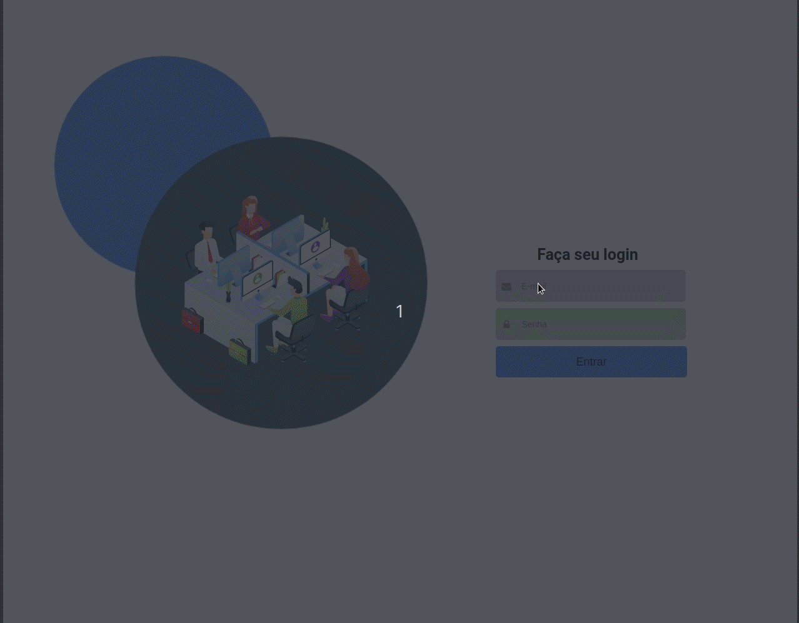

<!-- Please update value in the {}  -->

<h1 align="center">Onboarding App</h1>

## 💻 Demonstration

  <a href="https://onboarding-app-mocha.vercel.app/" alt="Site teste">
    <image src=".github/netlify.png" alt="netlify">
  </a>

<!-- TABLE OF CONTENTS -->

## ✔️ Table of Contents

- [Overview](##overview)
- [Contact](##contact)

<!-- OVERVIEW -->

## ✨ Overview

This project consists of a dashboard page simulating data about a company's employees and their respective costs. The [react-vis](https://uber.github.io/react-vis/) graphics library was used.

### 🚀 Built With

  

## 🔗 Contact

- GitHub [@jonbrand](https://github.com/jonbrand)
- Linkedin [@Jonatas Brandão](https://www.linkedin.com/in/jonatas-brand%C3%A3o/)

## 📝 License

This project is under the MIT license. See the file[LICENSE](.github/LICENSE.md) para mais detalhes.

---

  

